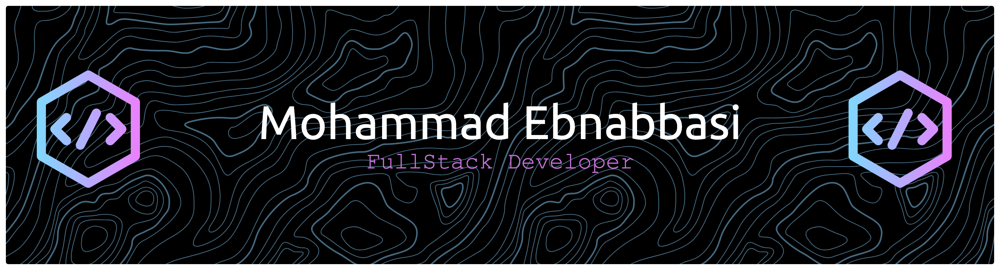

👋 Hi there, I'm Mo! By day, I'm a 2nd year Computer Science student at the University of South Wales and by night, I am a builder of code, hunting down solutions, and chasing bugs in the shadows... 🦇  🔬 What I am learning and working on: - Honing my skills in C++, C# and Python. - Secretly training in art of the MERN stack. - Working on project Nautilus w/ collaborators. Facial recognition &  emotion detection program. 🧪  🛠️ Tech Stack: Languages - Python | C# | C++ | JavaScript Databases - MongoDB | MySQL Tools - GitHub | VS Code | Visual Studio 🔩  ⚡️ Hobbies: - Love to code at night 🌙 - Warhammer 40K enjoyer (Salamanders 💚) - I love weightlifting, particularly for strength - I also love cats (perfect bug-hunting companion)  Contact: mebnabbasi20@gmail.com  

## 🌐 Socials:
   

# 💻 Tech Stack:
         
# 📊 GitHub Stats:
 
 

### 🔝 Top Contributed Repo

<!-- Proudly created with GPRM ( https://gprm.itsvg.in ) -->
